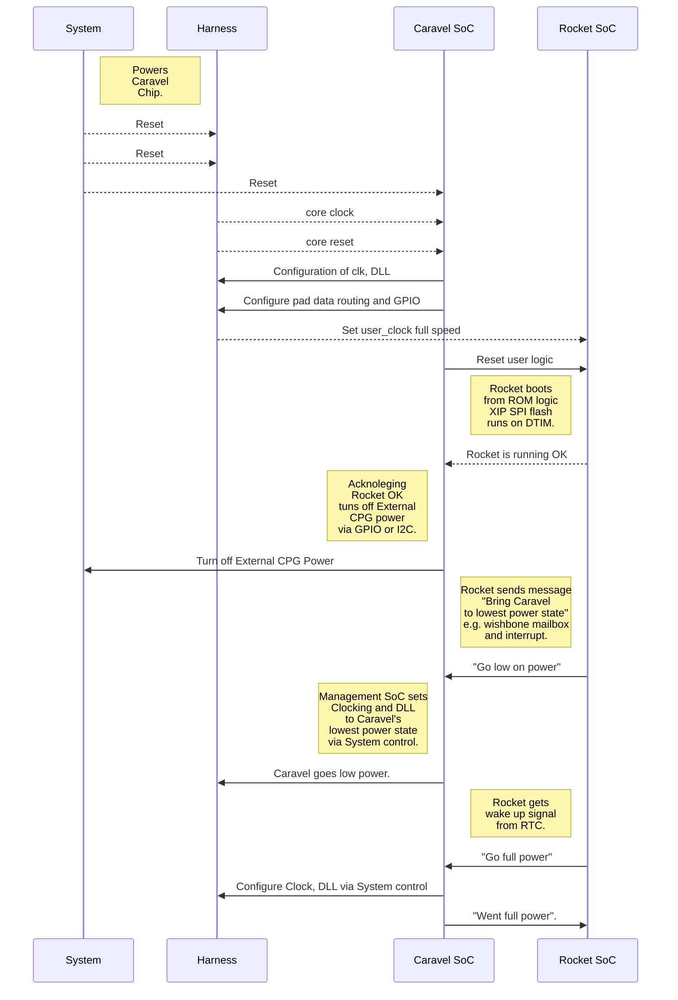

# Marmot RISC-V SoC

  

## A Customizable RISC-V Microcomputer

A custom microcomputer design is useful when off-the-shelf general-purpose microcontrollers fail to meet the system needs. The rocket SoC generator automatically generate an SoC. It circumvents labor-intensive, error-prone, top-level SoC design.


## SoC Customization Flow

The Rocket SoC Generator and Caravel SoC Template are reused to create a twin (not identical) RISC-V SoC consisting of one Rocket RISC-V and one Caravel RISC-V. The objectives here is to save hours on design verification and reduce power consumption rather than saving die area or chip cost.

  ```mermaid
graph TD
A(A SoC Wish List) -- SoC Description in Chisel--> B
B[The Rocket SoC Generator] --SoC RTL--> D[The OpenLane Flow]
C[Caravel SoC Harness] --Harness RTL--> D
B --FPGA RTL--> L
P[RISC-V IDE Tools]--Code and Executables-->H
L[_Yosys_+nextpnr] --Bitstream--> K[Lattice ECP5 Eval Board]
E(Caravel Firmware)  --Init, Monitoring, Debug--> C
D --Sky130 GDS II Layout Data--> F[eFabless MPW]
O[Xschema]--Circuit schematics-->J
F --MPW Chips--> H
F --MPW Chips--> I
I[Caravel EVB] --Breadboarding-->H{User system}
J[KiCad]--Gerber and BOM-->H
```


##  Implementing low power operations

The following shows a scheme to manage clock, reset, power and low power state.



## Features
|Unit |Description
|-------|-------|
|RISC-V CPU|RV32IMAC, M/S/U-mode (Rocket)
|I-Cache|Instruction cache: 16 KiB<br>(Up to 8 KiB can be configured as Instruction Tightly Integrated Memory (ITIM))
|D-Cache|Data cache: 8 KiB
|GPIO  |General Purpose Input/Output Controller
|QSPI0 |Quad Serial Peripheral Interface (QSPI) for (Q)SPI-Flash memory (XIP supported)
|QSPI1 |Quad Serial Peripheral Interface (QSPI) for (Q)SPI-Peripherals (CS x2)
|QSPI2 |Quad Serial Peripheral Interface (QSPI) for (Q)SPI-PSRAM (XIP supported)
|UART0-4|Universal Asynchronous Receiver/Transmitter (UART) x5
|I2C0-1|Inter-Integrated Circuit (I2C) Master Interface x2
|PWM0-2|Pulse Width Modulator (PWM) (4x 16-bit comparators/unit) x3
|Debug|Debug functions, JTAG I/F

Refer to [Freedom E310-G002 Manual](https://sifive.cdn.prismic.io/sifive/b56b304f-cd2d-421b-9c14-6b35c33f172e_fe310-g002-manual-v1p4.pdf) for detailed specification of each unit except QSPI2.
For QSPI2, refer to *docs/SPI_with_PSRAM_Interface.pdf* .

## Pinouts
mprj_io[#]|Mgmt. SoC|Marmot IOF0|Marmot IOF1|Marmot GPIO|
|-------|-------|-------|-------|-------|
0|JTAG|-|-|-
1|SDO|TDO|-|-
2|SDI|TDI|-|-
3|CSB|TMS|-|-
4|SCK|TCK|-|-
5|ser_rx|UART0_rx|-|-
6|ser_tx|UART0_tx|-|-
7|irq|QSPI1_csb[1]|-|GPIO[24]
8|flash2_csb|QSPI0_flash_csb|-|-
9|flash2_sck|QSPI0_flash_sck|-|-
10|flash2_io[0]|QSPI0_flash_io[0]|-|-
11|flash2_io[1]|QSPI0_flash_io[1]|-|-
12|-|QSPI0_flash_io[2]|-|-
13|-|QSPI0_flash_io[3]|-|-
14|-|QSPI1_csb[0]|-|GPIO[0]
15|-|QSPI1_sck|-|GPIO[1]
16|-|QSPI1_io[0]|-|GPIO[2]
17|-|QSPI1_io[1]|-|GPIO[3]
18|-|QSPI1_io[2]|-|GPIO[4]
19|-|QSPI1_io[3]|-|GPIO[5]
20|-|QSPI2_csb|-|-
21|-|QSPI2_sck|-|-
22|-|QSPI2_io[0]|-|-
23|-|QSPI2_io[1]|-|-
24|-|QSPI2_io[2]|-|-
25|-|QSPI2_io[3]|-|-
26|-|I2C0_sda|PWM0_0|GPIO[12]
27|-|I2C0_scl|PWM0_1|GPIO[13]
28|-|I2C1_sda|PWM0_2|GPIO[14]
29|-|I2C1_scl|PWM0_3|GPIO[15]
30|-|UART1_rx|PWM1_0|GPIO[16]
31|-|UART1_tx|PWM1_1|GPIO[17]
32|-|UART2_rx|PWM1_2|GPIO[18]
33|-|UART2_tx|PWM1_3|GPIO[19]
34|-|UART3_rx|PWM2_0|GPIO[20]
35|-|UART3_tx|PWM2_1|GPIO[21]
36|-|UART4_rx|PWM2_2|GPIO[22]
37|-|UART4_tx|PWM2_3|GPIO[23]

## Address Map
Base|Top|Attribute|Unit|Description
|-------|-------|-------|-------|-------|
0x0000_0000|0x0000_0FFF|RWX A|Debug|Debug Address Space
0x0000_1000|0x0000_2FFF|-|Reserved|-
0x0000_3000|0x0000_3FFF|RWX A|Error Device|Error Address Space
0x0000_4000|0x0000_FFFF|-|Reserved|-
0x0001_0000|0x0001_1FFF|R XC|Boot ROM|Boot ROM (8 KiB)
0x0001_2000|0x0002_1FFF|-|Reserved|-
0x0200_0000|0x0200_FFFF|RW A|CLINT|Core-Local Interruptor
0x0201_0000|0x07FF_FFFF|-|Reserved|-
0x0800_0000|0x0800_1FFF|RWX A|ITIM|Instruction Tightly Integrated Memory (up to 8KiB)
0x0800_2000|0x0BFF_FFFF|-|Reserved|-
0x0C00_0000|0x0FFF_FFFF|RW A|PLIC|Platform-Level Interrupt Controller
0x1000_0000|0x1000_0FFF|RW A|AON|Always-On Domain (WDT, RTC, PMU, etc.)
0x1000_1000|0x1001_1FFF|-|Reserved|-
0x1001_2000|0x1001_2FFF|RW A|GPlO|General Purpose Input/Output Controller
0x1001_3000|0x1001_3FFF|RW A|UART0|Universal Asynchronous Receiver/ Transmitter #0
0x1001_4000|0x1001_4FFF|RW A|QSPI0|Quad Serial Peripheral Interface #0 for (Q)SPI-Flash memory (XIP supported)
0x1001_5000|0x1001_5FFF|RW A|PWM0|Pulse Width Modulator #0
0x1001_6000|0x1001_6FFF|RW A|I2C0|Inter-Integrated Circuit Master Interface #0
0x1001_7000|0x1002_2FFF|-|Reserved|-
0x1002_3000|0x1002_3FFF|RW A|UART1|Universal Asynchronous Receiver/ Transmitter #1
0x1002_4000|0x1002_4FFF|RW A|QSPI1|Quad Serial Peripheral Interface #1 for (Q)SPI-Peripherals
0x1002_5000|0x1002_5FFF|RW A|PWM1|Pulse Width Modulator #1
0x1002_6000|0x1002_6FFF|RW A|I2C1|Inter-Integrated Circuit Master Interface #1
0x1002_7000|0x1003_2FFF|-|Reserved|-
0x1003_3000|0x1003_3FFF|RW A|UART2|Universal Asynchronous Receiver/ Transmitter #2
0x1003_4000|0x1003_4FFF|RW A|QSPI2|Quad Serial Peripheral Interface #2 for (Q)SPI-PSRAM (XIP supported)
0x1003_5000|0x1FFF_FFFF|RW A|PWM2|Pulse Width Modulator #2
0x1004_3000|0x1005_2FFF|RW A|UART3|Universal Asynchronous Receiver/ Transmitter #3
0x1004_4000|0x1005_2FFF|-|Reserved|-
0x1005_3000|0x1005_3FFF|RW A|UART4|Universal Asynchronous Receiver/ Transmitter #4
0x1005_4000|0x1FFF_FFFF|-|Reserved|-
0x2000_0000|0x3FFF_FFFF|R XC|(Q)SPI-Flash|Off-Chip (Q)SPI-Flash Memory (up to 512 MiB)
0x4000_0000|0x5FFF_FFFF|RWXC|(Q)SPI-PSRAM|Off-Chip (Q)SPI-PSRAM (up to 512 MiB)
0x6000_0000|0xFFFF_FFFF|-|Reserved|-

## Reference

[Marmot RISC-V ASIC for Motor Control (Efabless MPW-7 project)](https://platform.efabless.com/projects/1288)

[Freedom E310-G002 Manual](https://sifive.cdn.prismic.io/sifive/b56b304f-cd2d-421b-9c14-6b35c33f172e_fe310-g002-manual-v1p4.pdf)

[Chipyard Framework](https://github.com/ucb-bar/chipyard)

[The Rocket Chip Generator](http://www.eecs.berkeley.edu/Pubs/TechRpts/2016/EECS-2016-17.html)

[Efabless Caravel Architecture](https://caravel-harness.readthedocs.io/en/latest/getting-started.html)

## Acknowledgements

This work is based on results obtained from project, JPNP16007, commissioned by The New Energy and Industrial Technology Development Organization (NEDO).
